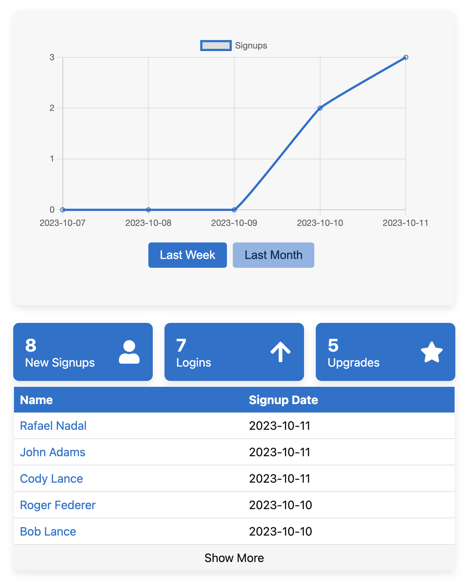
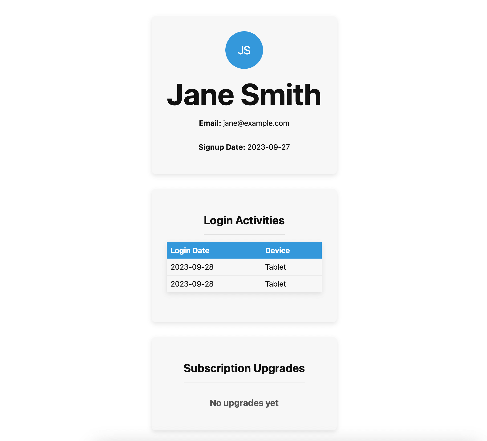
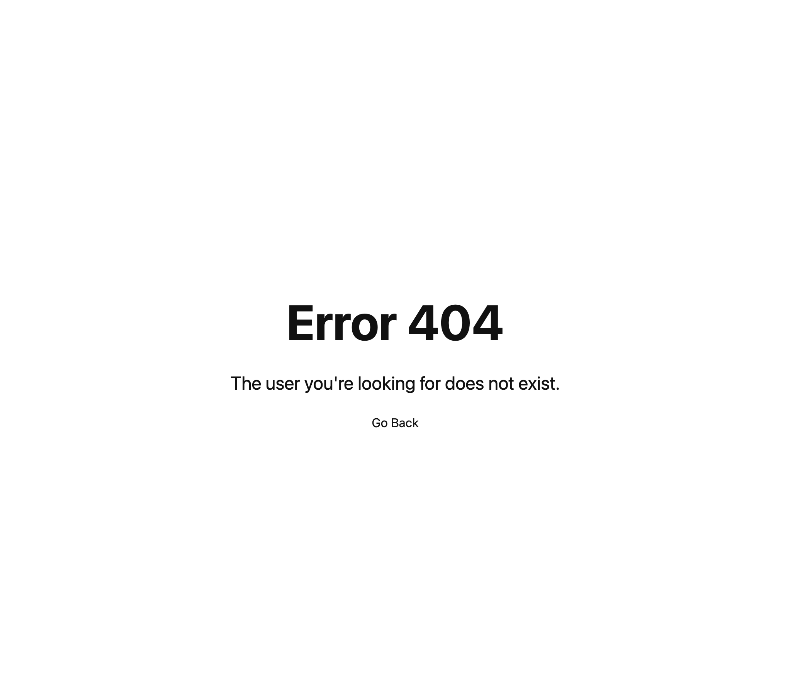

# Next.js Test

A test project simulating a dashboard using Next.js, TypeScript, and mock API routes.

## Setup

1. Clone the repository
2. Install dependencies:
   `npm install`
3. Create an `.env` file and fill in the following environmental variable:
   `LOCAL_HOST=http://localhost:3000`

## Preview

### Homepage

### User Page

### Error Page

